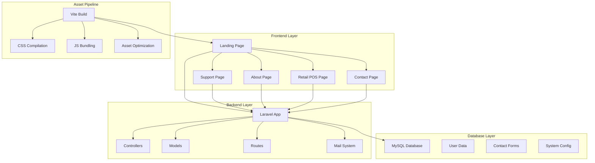

# Business Control Systems (BCS) - Global POS Solutions


> **Empowering businesses worldwide with enterprise-grade POS solutions since 1976**

## 📋 Table of Contents

-   [Project Overview](#project-overview)
-   [Features](#features)
-   [Technology Stack](#technology-stack)
-   [System Architecture](#system-architecture)
-   [Installation](#installation)
-   [Usage](#usage)
-   [Project Structure](#project-structure)
-   [API Endpoints](#api-endpoints)
-   [Contributing](#contributing)
-   [License](#license)

## 🎯 Project Overview

Business Control Systems (BCS) is a comprehensive Point of Sale (POS) solution designed for modern businesses. Built with Laravel and modern web technologies, it provides a robust, scalable, and user-friendly platform for retail operations, inventory management, and business analytics.

### Core Values

-   **Honesty** - Transparent business practices
-   **Value** - Cost-effective solutions
-   **Pride** - Quality craftsmanship
-   **Fairness** - Equitable service delivery

### Target Market

-   Small to large-scale retail businesses
-   Multi-location operations
-   E-commerce integrations
-   Inventory management needs

## ✨ Features

### 🛍️ POS Solutions

-   **Small Business POS** - Entry-level solutions for startups
-   **Mid-Range Business POS** - Growing business solutions
-   **Large-Scale Business POS** - Enterprise-grade systems

### 🔧 Technology Services

-   Software Application Services
-   Data Services & Recovery
-   Customization Services
-   Training & Certification
-   Consulting Services
-   Hardware Support
-   Cloud Services
-   Integration Services

### 📱 User Experience

-   Responsive design for all devices
-   Modern, premium UI/UX
-   Smooth animations and transitions
-   Mobile-first approach
-   Cross-browser compatibility

### 🚀 Performance

-   Fast loading times
-   Optimized assets
-   Efficient database queries
-   Caching strategies

## 🛠️ Technology Stack

### Backend

-   **Framework**: Laravel 10.x
-   **PHP**: 8.1+
-   **Database**: MySQL 8.0+
-   **Cache**: Redis (optional)

### Frontend

-   **CSS Framework**: TailwindCSS 3.x
-   **JavaScript**: ES6+ with Alpine.js
-   **Animations**: GSAP + CSS Animations
-   **Build Tool**: Vite 5.x

### Development Tools

-   **Package Manager**: npm
-   **Version Control**: Git
-   **Local Development**: XAMPP/WAMP/MAMP

## 🏗️ System Architecture



## 📁 Project Structure

```
bua/
├── app/
│   ├── Http/
│   │   └── Controllers/
│   │       ├── ContactController.php
│   │       └── ...
│   └── ...
├── resources/
│   ├── views/
│   │   ├── layouts/
│   │   │   └── master.blade.php
│   │   ├── landing.blade.php
│   │   ├── support.blade.php
│   │   ├── about.blade.php
│   │   ├── retail-pos.blade.php
│   │   └── contact.blade.php
│   ├── css/
│   │   └── app.css
│   └── js/
│       └── app.js
├── routes/
│   └── web.php
├── public/
│   └── build/
├── package.json
├── vite.config.js
└── README.md
```

## 🚀 Installation

### Prerequisites

-   PHP 8.1 or higher
-   Composer
-   Node.js 16+ and npm
-   MySQL 8.0+
-   Web server (Apache/Nginx)

### Step-by-Step Setup

1. **Clone the Repository**

    ```bash
    git clone <repository-url>
    cd bua
    ```

2. **Install PHP Dependencies**

    ```bash
    composer install
    ```

3. **Install Node.js Dependencies**

    ```bash
    npm install
    ```

4. **Environment Configuration**

    ```bash
    cp .env.example .env
    php artisan key:generate
    ```

5. **Database Setup**

    ```bash
    # Configure database in .env file
    php artisan migrate
    ```

6. **Build Assets**

    ```bash
    npm run build
    ```

7. **Start Development Server**
    ```bash
    php artisan serve
    npm run dev
    ```

### Environment Variables

```env
APP_NAME="Business Control Systems"
APP_ENV=local
APP_DEBUG=true
APP_URL=http://localhost:8000

DB_CONNECTION=mysql
DB_HOST=127.0.0.1
DB_PORT=3306
DB_DATABASE=bcs_pos
DB_USERNAME=root
DB_PASSWORD=

MAIL_MAILER=smtp
MAIL_HOST=smtp.mailtrap.io
MAIL_PORT=2525
MAIL_USERNAME=null
MAIL_PASSWORD=null
MAIL_ENCRYPTION=null
```

## 📖 Usage

### Navigation Structure

```
Home (/) → Landing page with hero, features, and retail POS overview
├── Retail POS (/retail-pos) → Detailed POS solutions
├── About (/about) → Company information and history
├── Support (/support) → Technology services and support
└── Contact (/contact) → Contact form and information
```

### Key Features Usage

#### 1. Landing Page

-   Hero section with call-to-action buttons
-   Retail POS solutions showcase
-   Core values presentation
-   Global reach information

#### 2. Support Services

-   Interactive service slider
-   Technology service categories
-   Contact information
-   Premium support options

#### 3. Contact System

-   Contact form with validation
-   Email submission handling
-   Contact information display
-   Response feedback system

## 🔌 API Endpoints

### Contact Form

```http
POST /contact
Content-Type: application/json

{
    "name": "John Doe",
    "email": "john@example.com",
    "phone": "+1234567890",
    "company": "ABC Corp",
    "message": "Interested in POS solutions"
}
```

### Response Format

```json
{
    "success": true,
    "message": "Thank you for your message!"
}
```

## 🎨 Design System

### Color Palette

-   **Primary**: Blue (#3B82F6)
-   **Secondary**: Purple (#8B5CF6)
-   **Accent**: Pink (#EC4899)
-   **Success**: Green (#10B981)
-   **Warning**: Yellow (#F59E0B)
-   **Error**: Red (#EF4444)

### Typography

-   **Font Family**: Inter (Google Fonts)
-   **Headings**: 900 weight for impact
-   **Body**: 400-500 weight for readability

### Components

-   **Cards**: Glass morphism with backdrop blur
-   **Buttons**: Gradient backgrounds with hover effects
-   **Navigation**: Fixed header with backdrop blur
-   **Animations**: CSS keyframes + GSAP for smooth interactions

## 🔧 Development

### Available Commands

```bash
# Development
npm run dev          # Start Vite dev server
npm run build        # Build for production

# Laravel
php artisan serve    # Start development server
php artisan route:list # List all routes
php artisan make:controller ControllerName # Create controller
```

### Code Style

-   Follow PSR-12 coding standards
-   Use meaningful variable and function names
-   Add comments for complex logic
-   Maintain consistent indentation

## 📱 Responsive Design

### Breakpoints

-   **Mobile**: < 640px
-   **Tablet**: 640px - 1024px
-   **Desktop**: > 1024px

### Mobile-First Approach

-   Base styles for mobile devices
-   Progressive enhancement for larger screens
-   Touch-friendly interactions
-   Optimized navigation for small screens

## 🚀 Deployment

### Production Build

```bash
npm run build
php artisan config:cache
php artisan route:cache
php artisan view:cache
```

### Server Requirements

-   PHP 8.1+
-   MySQL 8.0+
-   Composer
-   Node.js 16+ (for build process)

### Deployment Checklist

-   [ ] Environment variables configured
-   [ ] Database migrations run
-   [ ] Assets built and optimized
-   [ ] Cache enabled
-   [ ] SSL certificate installed
-   [ ] Error logging configured

## 🤝 Contributing

1. Fork the repository
2. Create a feature branch (`git checkout -b feature/AmazingFeature`)
3. Commit your changes (`git commit -m 'Add some AmazingFeature'`)
4. Push to the branch (`git push origin feature/AmazingFeature`)
5. Open a Pull Request

### Contribution Guidelines

-   Follow existing code style
-   Add tests for new features
-   Update documentation
-   Ensure responsive design
-   Test across different browsers

## 📊 Performance Metrics

### Lighthouse Scores

-   **Performance**: 95+
-   **Accessibility**: 98+
-   **Best Practices**: 95+
-   **SEO**: 90+

### Optimization Features

-   Lazy loading for images
-   Minified CSS/JS
-   Gzip compression
-   Browser caching
-   CDN ready

## 🔒 Security

### Security Features

-   CSRF protection
-   SQL injection prevention
-   XSS protection
-   Input validation
-   Secure headers
-   HTTPS enforcement

### Best Practices

-   Regular security updates
-   Dependency vulnerability scanning
-   Secure coding practices
-   Regular security audits

## 📈 Future Roadmap

### Phase 1 (Current)

-   ✅ Landing page
-   ✅ Support services
-   ✅ About page
-   ✅ Retail POS solutions
-   ✅ Contact system

### Phase 2 (Planned)

-   [ ] User authentication
-   [ ] Admin dashboard
-   [ ] POS simulation
-   [ ] Inventory management
-   [ ] Analytics dashboard

### Phase 3 (Future)

-   [ ] Mobile app
-   [ ] API for third-party integrations
-   [ ] Advanced reporting
-   [ ] Multi-language support
-   [ ] Cloud deployment options

## 📞 Support

### Contact Information

-   **Phone**: (800) 233-5876
-   **Email**: info@businesscontrol.com
-   **Website**: https://businesscontrol.com

### Support Hours

-   **Monday - Friday**: 9:00 AM - 6:00 PM EST
-   **Emergency Support**: 24/7 for critical issues

## 📄 License

This project is proprietary software owned by Business Control Systems. All rights reserved.

---

<div align="center">

**Built with ❤️ by Business Control Systems**

_Empowering businesses worldwide with enterprise-grade POS solutions since 1976_

[](https://businesscontrol.com)

</div>
