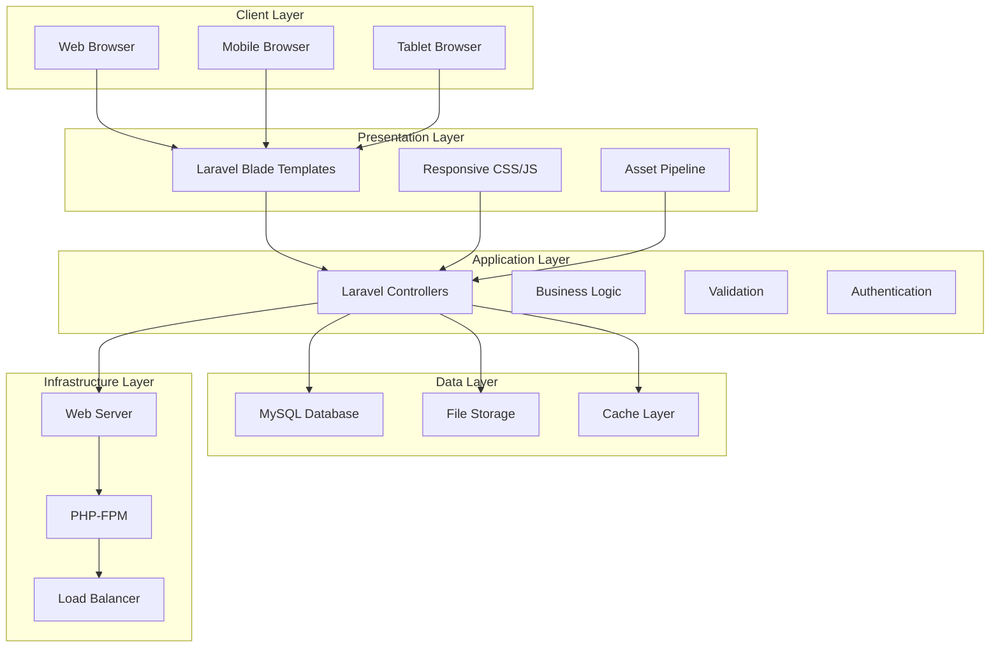
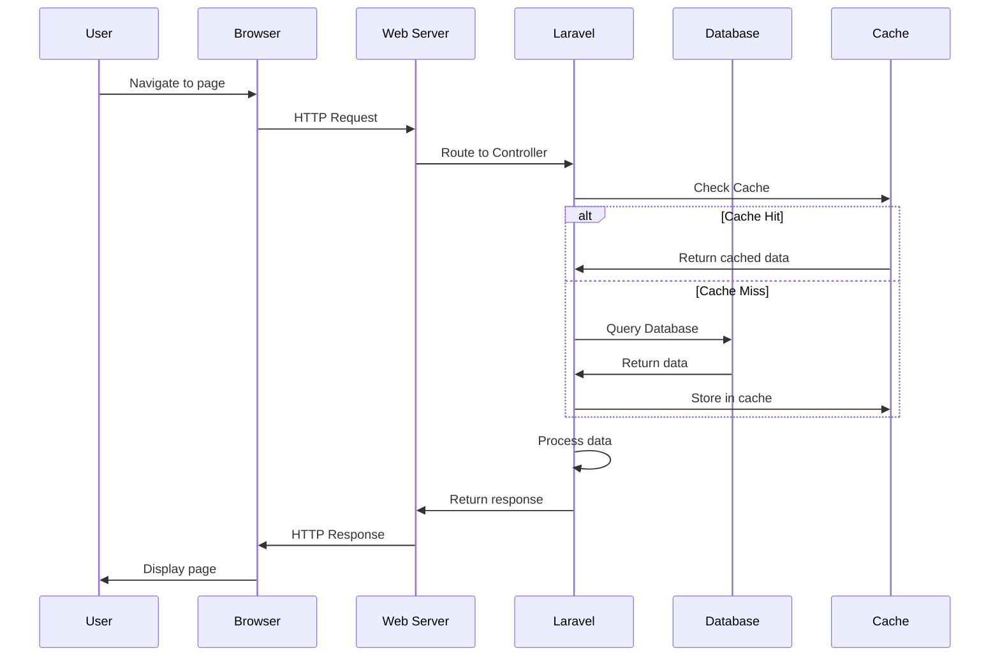
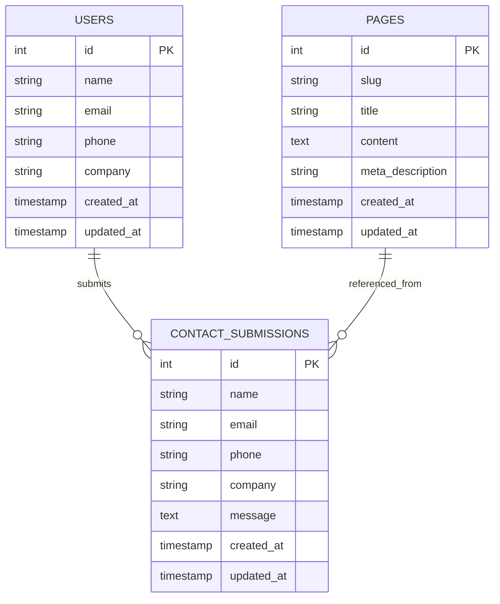
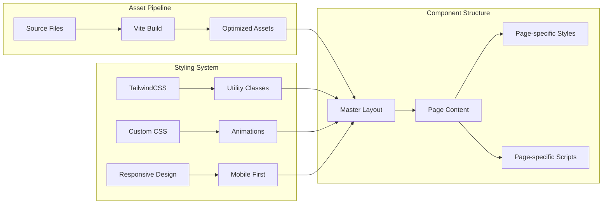
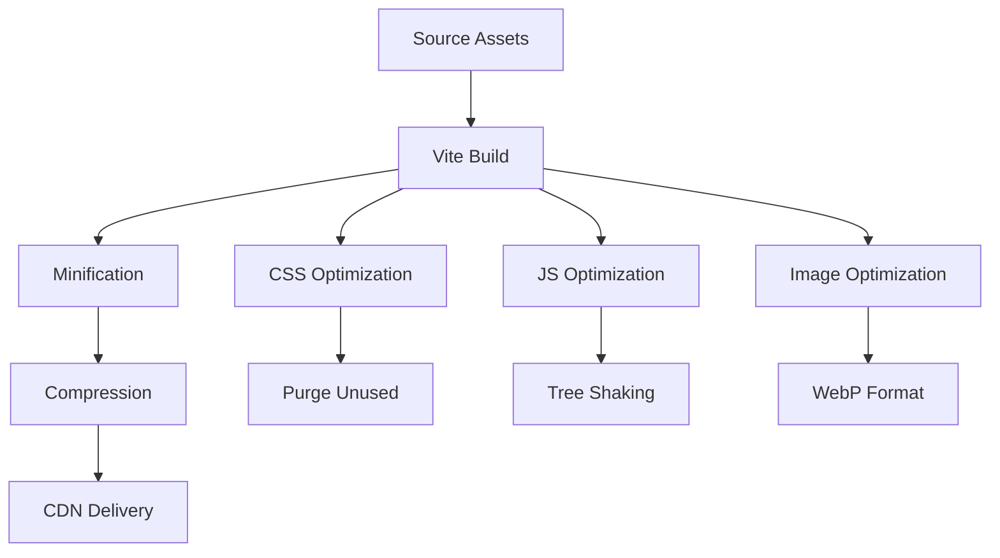
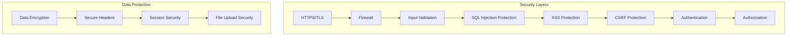
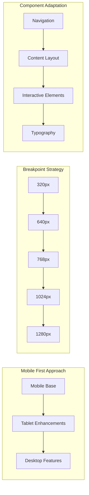
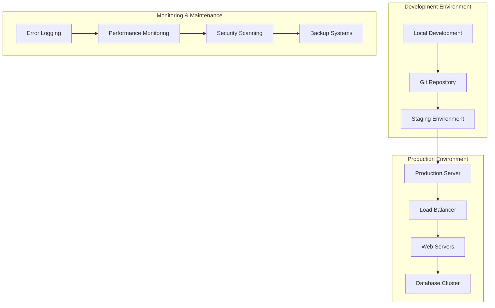

# Business Control Systems - Technical Architecture

## 🏗️ System Overview

Business Control Systems (BCS) is built on a modern, scalable architecture that follows industry best practices for web applications.

## 📊 High-Level Architecture

## 🔄 Request Flow Diagram

## 🗄️ Database Schema

## 🎨 Frontend Architecture

## 🔧 Technology Stack Details

### Backend Technologies

#### Laravel Framework

-   **Version**: 10.x (LTS)
-   **PHP Version**: 8.1+
-   **Architecture**: MVC Pattern
-   **Features**:
    -   Eloquent ORM
    -   Blade Templating
    -   Artisan CLI
    -   Queue System
    -   Event Broadcasting

#### Database

-   **Primary**: MySQL 8.0+
-   **Features**:
    -   ACID Compliance
    -   Transaction Support
    -   Indexing Strategies
    -   Backup & Recovery

#### Caching

-   **Strategy**: Multi-layer caching
-   **Options**: Redis, Memcached, File
-   **Implementation**: Laravel Cache Facade

### Frontend Technologies

#### CSS Framework

-   **TailwindCSS**: Utility-first CSS framework
-   **Version**: 3.x
-   **Features**:
    -   Responsive utilities
    -   Dark mode support
    -   Custom color palette
    -   Component variants

#### JavaScript

-   **Alpine.js**: Lightweight reactive framework
-   **ES6+**: Modern JavaScript features
-   **Modules**: ES6 module system
-   **Bundling**: Vite for fast builds

#### Build Tools

-   **Vite**: Next-generation build tool
-   **Features**:
    -   Hot Module Replacement
    -   Fast builds
    -   Optimized output
    -   Tree shaking

## 🚀 Performance Optimization

### Frontend Optimization

### Backend Optimization

-   **Database**: Query optimization, indexing
-   **Caching**: Redis, application-level caching
-   **Code**: OpCache, autoloader optimization
-   **Assets**: CDN, compression, caching headers

## 🔒 Security Architecture

### Security Features

-   **HTTPS Enforcement**: SSL/TLS encryption
-   **Input Validation**: Sanitization and validation
-   **SQL Injection**: Prepared statements
-   **XSS Protection**: Output escaping
-   **CSRF Protection**: Token-based validation
-   **Authentication**: Secure user management
-   **Authorization**: Role-based access control

## 📱 Responsive Design Architecture

### Responsive Features

-   **Mobile-First**: Base styles for mobile
-   **Progressive Enhancement**: Features for larger screens
-   **Flexible Grid**: CSS Grid and Flexbox
-   **Touch-Friendly**: Mobile-optimized interactions
-   **Performance**: Optimized for mobile networks

## 🔄 Deployment Architecture

### Deployment Strategy

-   **Environment Management**: Dev, Staging, Production
-   **Version Control**: Git-based deployment
-   **Automated Testing**: CI/CD pipeline
-   **Rollback Strategy**: Quick recovery options
-   **Monitoring**: Real-time performance tracking

## 📊 Scalability Considerations

### Horizontal Scaling

-   **Load Balancing**: Multiple web servers
-   **Database**: Read replicas, sharding
-   **Caching**: Distributed cache systems
-   **CDN**: Global content delivery

### Vertical Scaling

-   **Server Resources**: CPU, RAM, Storage
-   **Database**: Connection pooling, query optimization
-   **Application**: Code optimization, caching strategies

## 🔍 Monitoring & Analytics

### Performance Metrics

-   **Page Load Time**: Target < 2 seconds
-   **Time to First Byte**: Target < 200ms
-   **Core Web Vitals**: LCP, FID, CLS
-   **Error Rates**: Target < 0.1%

### Monitoring Tools

-   **Application**: Laravel Telescope, Logs
-   **Server**: Resource monitoring, uptime
-   **Database**: Query performance, connection status
-   **Frontend**: Real User Monitoring (RUM)

---

_This architecture document is part of the Business Control Systems technical documentation. For more information, contact the development team._

